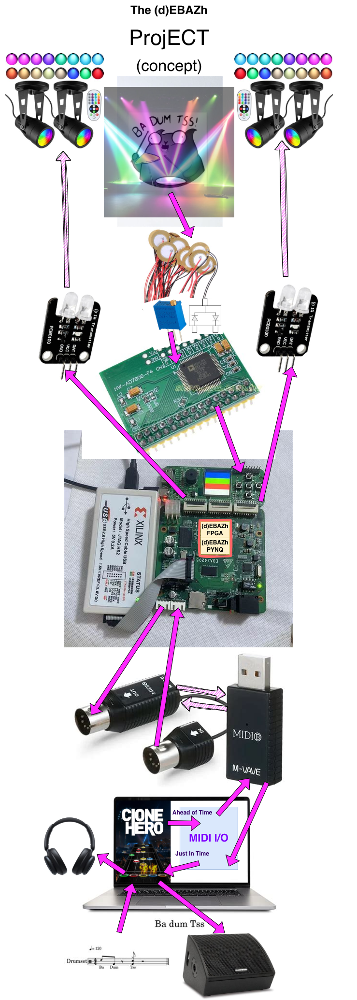

# (d)EBAZh Project

Project is dedicated to build rather cheap but powerful DIY e-drum kit

Main goals:

1. e-drum kit based only on piezo-triggers + adc + fpga (and silenced acoustic drums and cymbals) for:

- general triggering (attack/velocity)
- cross-talks reduction
- advanced triggering (multi-zones, rim-shots, choking, etc.)

2. drums entertainment system:

- clone-hero, sequencers, etc. as source
- time accurate hit detection
- lights(optional) to predict sequence, show hits and misses

# Project Overview

Generally first proto should look like:

## 1. E-Drums mode

1. Take acoustic kit, silence it, put piezo-triggers
2. Hit the drums
3. Voltage waveforms goes from piezo to ADC via necessary front end (about 16 channels required for full kit with advanced features)
4. ADC samples it (sampling frequency 1-2 MHz for each channel)
5. FPGA reads samples, does DSP magic, sends detected notes/events via MIDI (general / rf). Total latency shouldn't exceed 10ms +/-
6. Record / Vocalize notes with your favorite software
7. Setup kit, fine tune DSP processing over ethernet/wifi via web, app, api and ?midi?

## 2. Entertainment mode

1. Take a sheet / load song into clone hero, sequencer or similar software
2. Generate sequence ahead of time (for sequence prediction via lights)
3. Star sequence, sync with FPGA via ?midi?, ethernet, wifi or api
4. FPGA generates notification via lights, displays, etc (optionally)
5. Play Drums!
6. Thing would go almost same as for e-drums, but this time hits could be processed a bit differently so you would joy gaming
7. FPGA checks expected notes and actually hit notes, gather your stats, also it sends notification via lights, displays, etc (optionally)
8. Notes then are sent back to app via MIDI (general / rf) to close whole loop
9. Check your play/gaming stats via web, app, api

# Project Roadmap

## 1. E-Drums mode

1. `[x]` Acoustic kit is prepared (but I'm still struggling with hi-hat pressure sensor). Checked signals with oscilloscope (looks quite good, but also there is a questions to solve in future)
2. `[x]` Hardware prototype for signaling front-end, ADC and FPGA is set up
3. `[/]` Writing code for FPGA <-> ADC I/O (VHDL) `<-- We are here`
4. `[ ]` Capture waveforms via ADC/FPGA, check for sanity and compare with oscilloscope waveforms to make sure hardware is OK
5. `[ ]` Write code for FPGA <-> MIDI I/O (VHDL) (well... it's basically an UART)
6. `[ ]` Do rough triggering end measure delay
7. `[ ]` Gather multiple samples, build math model for DSP, evaluate expected performance, tune hardware
8. `[ ]` Implement DSP in FPGA (VHDL)
9. `[ ]` Test it, tune it
10. `[ ]` Kit setup and tuning via web, app, api, midi
11. `[ ]` Make stuff for building / replicating kits (PCB, 3D printing etc.)
12. `[ ]` Try to build second and third kit and make sure it's reproducible

> NOTE: steps 7-9 may take a lot of repetitions

## 2. Entertainment mode

1. `[ ]` Special hit's detection in FPGA (actually basic triggering implementation of e-drums mode with optional cross-talks suppression). We **already** may start to have some fun after this step!
2. `[ ]` Ahead of time sequence generation (off-line or on-line while playing)
3. `[ ]` Sequence loading into FPGA (over MIDI, ethernet/wifi, api)
4. `[ ]` Sequence playing in FPGA
5. `[ ]` Sequencer -> FPGA synchronization
6. `[ ]` Sequence checking in FPGA, metrics and stats
7. `[ ]` Lights control via FPGA (prediction, hits and misses)
8. `[ ]` Extra display support via FPGA/CPU(use Zynq's CPU for main logic) to play like hero with any sequencer
9. `[ ]` Wrap it up for best user experience!

# Further plans

Supports Guitars, Bass, Keys, etc. for complete set and total fun!
